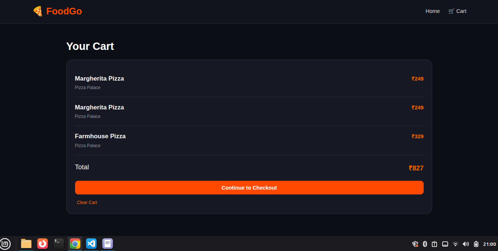
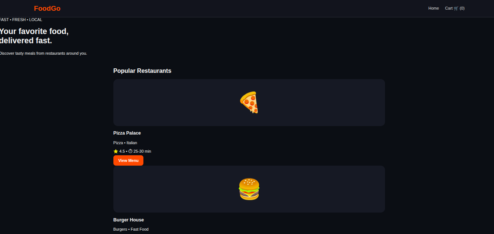
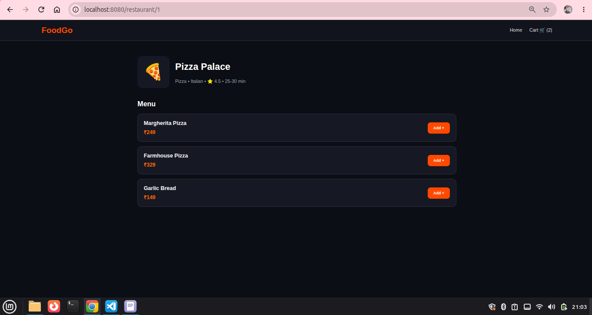
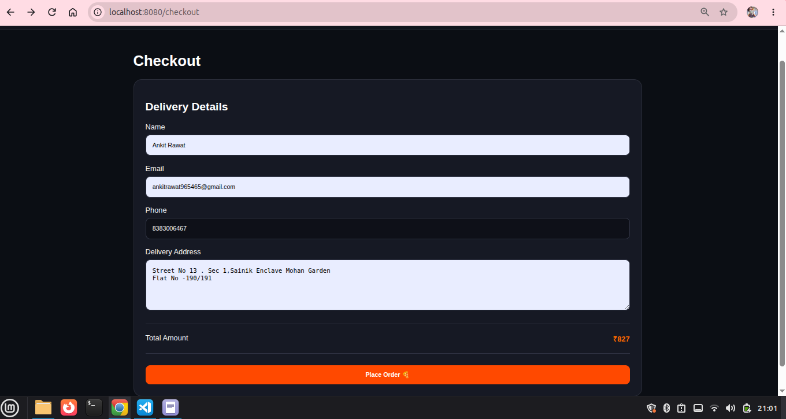
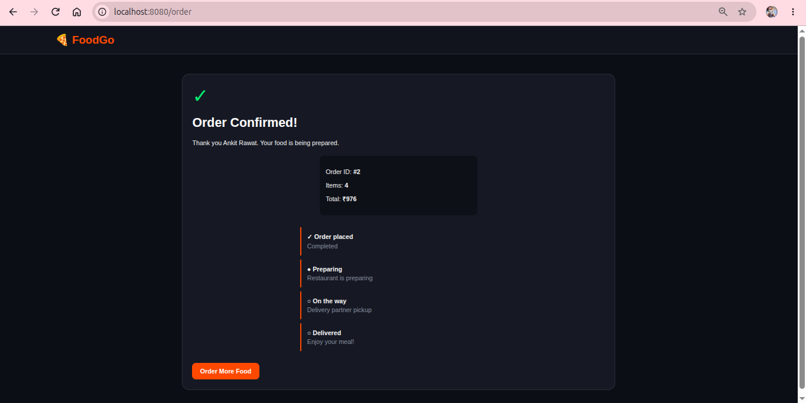
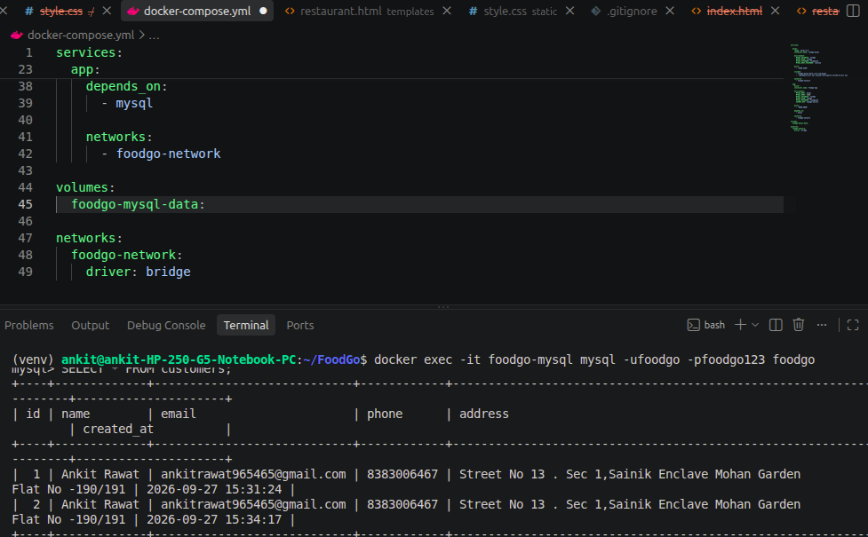

# 🍕 FoodGo

### Food Delivery Web Application — DevOps Practice Project


---

## 📌 About the Project

**FoodGo** is a food delivery web application developed as a hands-on **DevOps practice project**.

Users can browse restaurants, view menus, add food items to a cart, enter delivery details, and place an order.

The application is containerized using **Docker** and the Flask application communicates with a **MySQL 8.0 database** through Docker Compose.

The main purpose of this project is to understand how an application can be developed, containerized, connected to a database, troubleshooted, and prepared for Kubernetes deployment.

---

## 🚀 Application Features

* 🏠 FoodGo home page
* 🍕 Restaurant listing
* 📋 Restaurant menus
* 🛒 Shopping cart
* 💳 Checkout page
* 👤 Customer information
* 📦 Order placement
* 🗄️ MySQL data storage
* 🐳 Docker containerization
* 🔗 Docker Compose networking

---

## 🛠️ Technology Stack

| Technology        | Purpose                |
| ----------------- | ---------------------- |
| 🐍 Python 3.12    | Backend programming    |
| 🌶️ Flask         | Web framework          |
| 🌐 HTML           | Application pages      |
| 🎨 CSS            | UI design              |
| 🐬 MySQL 8.0      | Database               |
| 🐳 Docker         | Containerization       |
| 🔗 Docker Compose | Multi-container setup  |
| 🌿 Git            | Version control        |
| 🐙 GitHub         | Source code management |

---
## 📸 Application Screenshots

### 🛒 Your Cart


### 🍽️ Popular Restaurants


### 🍕 Pizza Palace — Add to Cart


### 📍 Delivery Address / Checkout


### ✅ Order Confirmation


### 🗄️ MySQL Database

## 🏗️ Architecture

```
text
                         👤 User
                           │
                           ▼
                    🌐 FoodGo Web App
                           │
                           ▼
                     🐍 Flask App
                           │
                    Docker Network
                           │
              ┌────────────┴────────────┐
              │                         │
              ▼                         ▼
        🐳 foodgo-app             🐬 foodgo-mysql
        Flask Application             MySQL 8.0
        Port: 8080                   Port: 3306
              │                         │
              └────────────┬────────────┘
                           │
                           ▼
                    🗄️ FoodGo Database
```

---

## 🔄 Application Flow

```text
🏠 Home
   ↓
🍕 Select Restaurant
   ↓
📋 View Menu
   ↓
➕ Add Food Item
   ↓
🛒 Cart
   ↓
💳 Checkout
   ↓
👤 Customer Details
   ↓
📦 Place Order
   ↓
🐍 Flask Backend
   ↓
🐬 MySQL Database
```

---

## 📁 Project Structure

```text
FoodGo/
│
├── app.py                  # Flask backend + application logic
├── requirements.txt        # Python dependencies
├── Dockerfile              # Docker image build instructions
├── docker-compose.yml      # Flask + MySQL configuration
├── .dockerignore           # Files excluded from Docker build
├── .gitignore              # Files excluded from Git
├── README.md               # Project documentation
│
├── database/
│   └── init.sql            # Database and table creation
│
├── templates/
│   ├── index.html          # Home page
│   ├── restaurant.html     # Restaurant menu
│   ├── cart.html           # Shopping cart
│   ├── checkout.html       # Checkout page
│   └── order.html          # Order confirmation
│
├── static/
│   └── style.css           # Application styling
│
└── screenshots/
    ├── 01-home.png
    ├── 02-menu.png
    ├── 03-cart.png
    ├── 04-checkout.png
    └── 05-order-confirmation.png
```

---

# 🗄️ Database

FoodGo uses **MySQL 8.0**.

### Database

```text
foodgo
```

### Tables

```text
customers
orders
order_items
```

### Database Relationship

```text
customers
    │
    │ customer_id
    ▼
 orders
    │
    │ order_id
    ▼
order_items
```

### `customers`

Stores customer delivery information.

```text
id
name
email
phone
address
created_at
```

### `orders`

Stores order information.

```text
id
customer_id
restaurant
total
created_at
```

### `order_items`

Stores individual food items belonging to an order.

```text
id
order_id
item_name
price
```

---

# 🐳 Docker Setup

FoodGo runs using two Docker containers:

```text
┌───────────────────────────────┐
│       foodgo-network          │
│                               │
│  ┌─────────────┐              │
│  │ foodgo-app  │              │
│  │   Flask     │              │
│  │   :8080     │              │
│  └──────┬──────┘              │
│         │                     │
│         │ MySQL connection    │
│         ▼                     │
│  ┌─────────────┐              │
│  │foodgo-mysql │              │
│  │   MySQL 8   │              │
│  │   :3306     │              │
│  └─────────────┘              │
│                               │
└───────────────────────────────┘
```

Docker Compose creates the network and allows the Flask application to communicate with MySQL using the service name:

```text
MYSQL_HOST=mysql
```

---

# ▶️ Run the Application

## 1. Clone Repository

```bash
git clone https://github.com/YOUR_USERNAME/FoodGo.git
cd FoodGo
```

## 2. Build and Start Containers

```bash
docker compose up -d --build
```

## 3. Check Running Containers

```bash
docker ps
```

Expected:

```text
foodgo-app
foodgo-mysql
```

## 4. Open Application

```text
http://localhost:8080
```

---

# 🔍 Verify Database

Enter the MySQL container:

```bash
docker exec -it foodgo-mysql mysql -ufoodgo -pfoodgo123 foodgo
```

Check tables:

```sql
SHOW TABLES;
```

Expected:

```text
customers
orders
order_items
```

Check customer records:

```sql
SELECT * FROM customers;
```

Check orders:

```sql
SELECT * FROM orders;
```

Check order items:

```sql
SELECT * FROM order_items;
```

Exit:

```sql
exit;
```

---

# 🧪 End-to-End Testing

The complete application was tested using this flow:

```text
Home
  ↓
Restaurant
  ↓
Menu
  ↓
Add to Cart
  ↓
Cart
  ↓
Checkout
  ↓
Customer Details
  ↓
Place Order
  ↓
Order Confirmation
  ↓
MySQL Database
```

After placing an order, customer and order information is stored in MySQL.

---

## 📸 Application Screenshots

### 🛒 Your Cart


### 🍽️ Popular Restaurants


### 🍕 Pizza Palace — Add to Cart


### 📍 Delivery Address / Checkout


### ✅ Order Confirmation


### 🗄️ MySQL Database


---
# 🎯 Project Objective

The main objective of FoodGo is to gain practical experience in deploying and managing a containerized web application.

The project focuses on understanding the complete journey:

```text
Application
    ↓
Docker Image
    ↓
Container
    ↓
Docker Compose
    ↓
Database
    
```

---

## 👨‍💻 Author

**Ankit Rawat**

